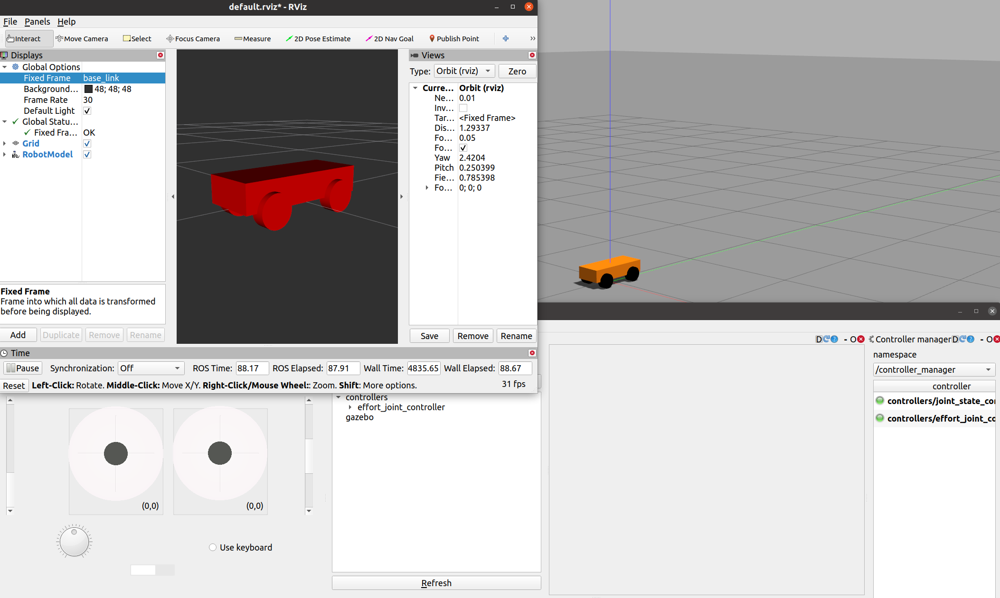

# Learning_task1
本次的作业是学习如何编写urdf文件，以及如何加载控制器并使自己的机器人运动起来。全程队员间可以互相交流，互相学习。本次任务无任何例程，禁止下载第三方包，不允许copy任何代码，要自己一步步完成。本次任务在你们离校前要完成，做的越快越好（这样我可以布置第二次doge

参考链接：

[urdf编写流程](https://dynamic-x-docs.netlify.app/quick_start/the_method_of_write_urdf.html)

[ros-controllers](https://github.com/ros-controls/ros_controllers)

[urdf tag详解](https://zhuanlan.zhihu.com/p/83280676)

[pre-commit](https://rm-control-docs.netlify.app/dev_guide/code_style#pre-commit-%E6%A0%BC%E5%BC%8F%E6%A3%80%E6%9F%A5%E5%99%A8)

在整个过程中，你需要完成的包括但不限于以下任务：

- 使用catkin初始化工作空间和编译代码
- 全程使用github管理自己的代码，有明确commit(使用clion的git操作，不得使用命令行，这里不会可以寻求学长帮助)（为了训练大家的规范能力，按照队里的规范操作）
    - `commit`要具体描述你这次干了什么，不要草草了事，开头要大写，结尾要有结束符；
    - `pr`要在pr的description里面具体描述你的任务效果，pr提交开头要大写。
    - 在每次commit前，使用pre-commit

- 使用.gitignore来隐藏部分没用的文件，不提交它们
- 在 ROS 中，提供了一些URDF文件相关的工具，比如:
    - `check_urdf`命令可以检查复杂的 urdf 文件是否存在语法问题；
    - `urdf_to_graphviz`命令可以查看 urdf 模型结构，显示不同 link 的层级关系。
- 全程自己编写机器人的urdf，并在rviz中检查机器人是否与仿真一致，并加载控制器让自己的机器人运动（不可使用gazebo内置插件，用ros官方提供的插件）
- 要使用Typora记录自己在本任务中学到什么，学习心得，具体讲清楚怎么搭建自己的机器人模型，如何控制自己的机器人运动，pr时要附上自己的学习笔记。
- 完成任务后要提起pr，请求合并。PR时请联系仓库管理者开一个新的分支。[PR仓库](https://github.com/YoujianWu/Learning_task)

本次任务的具体效果

