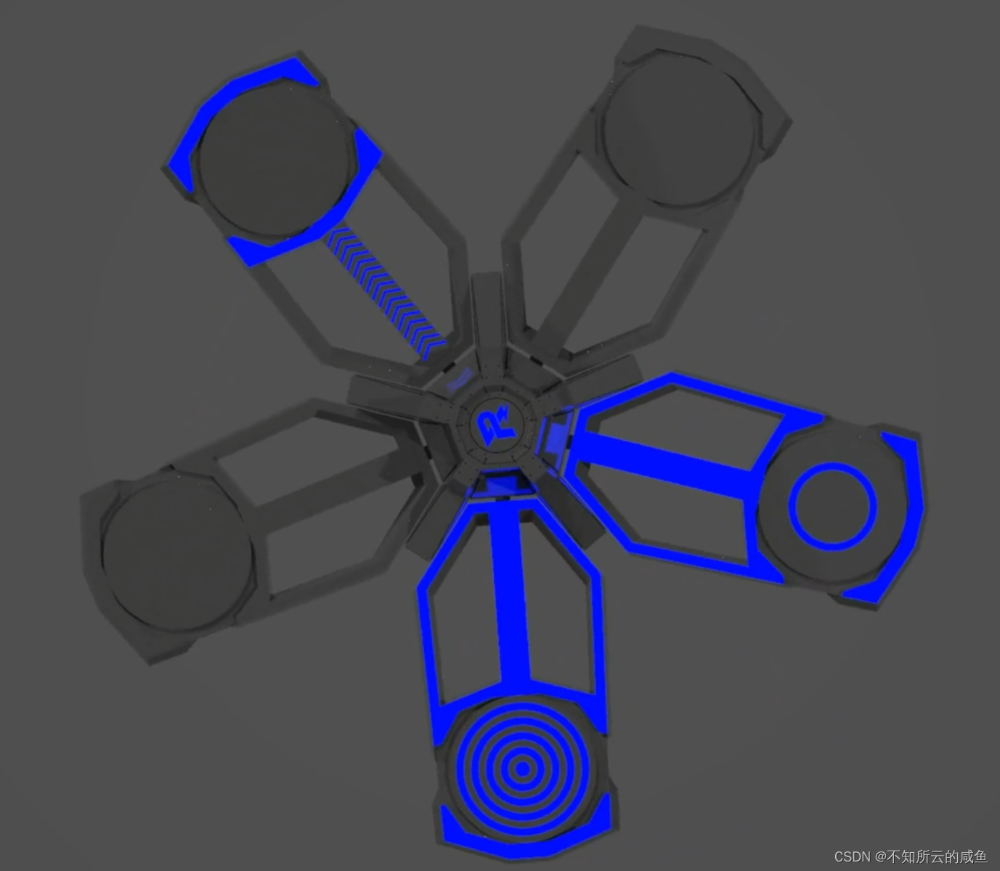
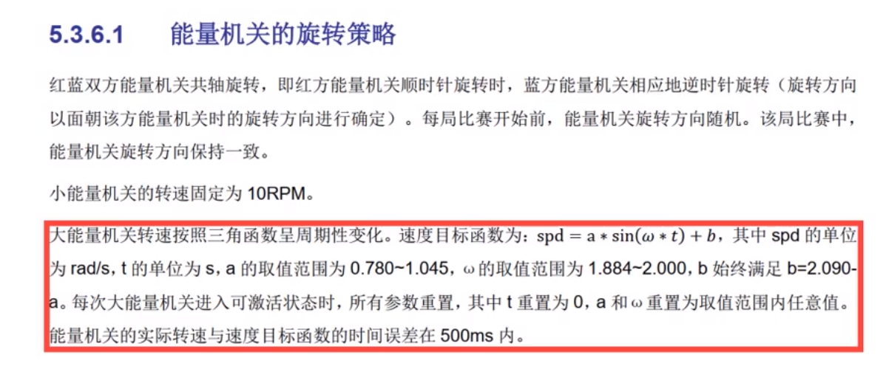
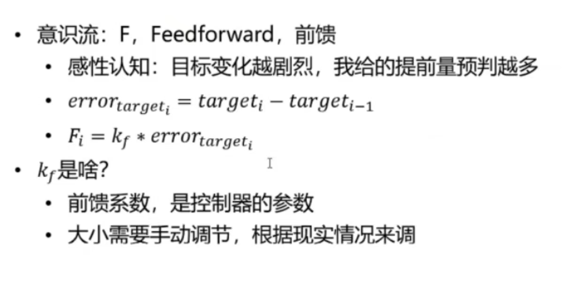

# Learning_task2

在RoboMaster比赛中，buff（增益）对于战局以及操作手的决策有着重大的影响。除了常见的跨越地形增益外，还有在固定时间刷新的大小能量机关增益，需要在一定时间内激活五片扇叶，并根据击打的环数给予机器人相应的增益。能量机关实物具体如下，由于其按照一定的规律转动，也可以亲切地叫它——风车。

为了调试方便，各个队伍都在制作自己的风车。假设现在我们队里需要制作一个风车，需要由我们来编写其运动程序。根据规则手册要求，大小能量的旋转策略如下：

本次的作业是利用**前馈**与**PID控制器**控制电机**实现**一种类似于**大/小能量机关**的运动速度**轨迹**。

在整个过程中，你需要完成的包括但不限于以下任务：

- 使用catkin初始化工作空间和编译代码。
- 了解什么是前馈，什么是PID控制器。
- 自己编写urdf。(搭个简易模型就可以了，比如就是一根摆杆在转)
- 自行编写控制器。

- 实物测试。（找一个M2006/M3508/GM6020，能否符合测试要求自己去看手册）
- 在配置文件中可以选择是否使用前馈。
- 使用plotjugger显示你的轨迹跟踪结果，无前馈的结果是怎么样的，有前馈的结果又是怎么样的。
- 请保证你的测试以及演示过程较为方便简单，比如我要激活大能量机关，我就用topic发个数字1就可以了。
- 要使用Typora记录自己在本任务中学到什么，学习心得，pr时要附上自己的学习笔记。

 **tips**:

动态目标前馈：

### PR规范

- 全程使用github管理自己的代码，有明确commit(使用clion的git操作，不得使用命令行，这里不会可以寻求学长帮助)（为了训练大家的规范能力，按照队里的规范操作）
    - `commit`要具体描述你这次干了什么，不要草草了事，开头要大写，结尾要有结束符；
    - `pr`要在pr的description里面具体描述你的任务效果，pr提交开头要大写。
    - 在每次commit前，使用pre-commit
- 使用.gitignore来隐藏部分没用的文件，不提交它们。
- 使用.clang-format和.clang-tidy
- 完成任务后要提起pr，请求合并。PR时请联系仓库管理者开一个新的分支。[PR仓库](https://github.com/YoujianWu/Learning_task)

